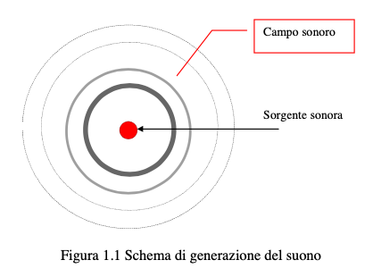

### Suono: 
Da un punto di vista fisico per suono in un certo punto dello spazio si intende una rapida variazione di pressione ( compressione e rarefazione ) intorno al valore assunto dalla pressione atmosferica in quel punto.

### Sorgente sonora:

qualsiasi dispositivo, apparecchio ecc. che provochi direttametne o indirettamente (as esempio per percussione) dette variazioni di pressione

### Campo sonoro:
affinche' il suono si propaghi occorre poi che il mezzo che circonda la sorgente sonora sia dotato di elasticita'. La porzione dello spazio interessata da tali variazioni di pressione e' allora definita campo sonoro

Schema di generazione del suono

### Lunghezza d'onda $\lambda$:

